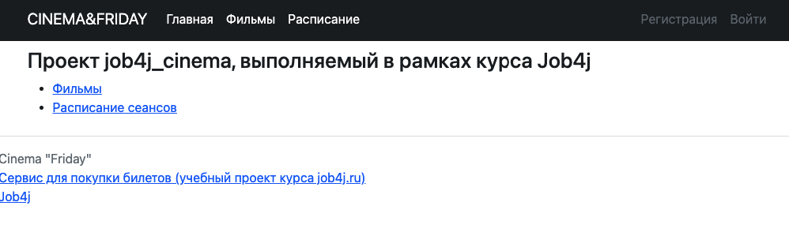
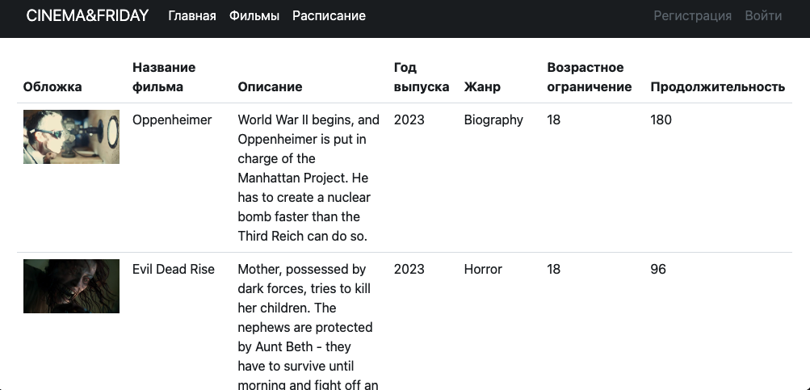
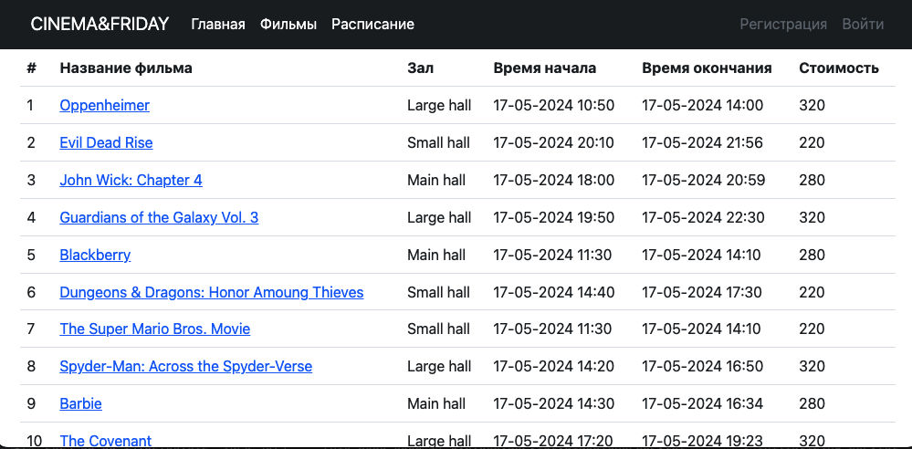
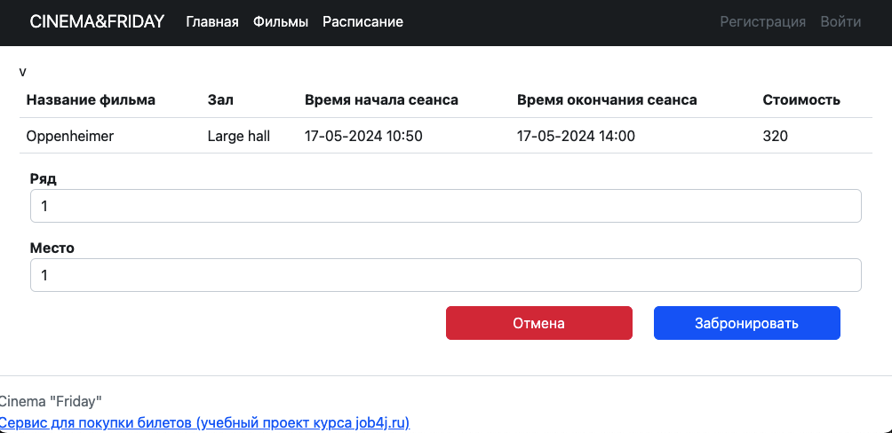
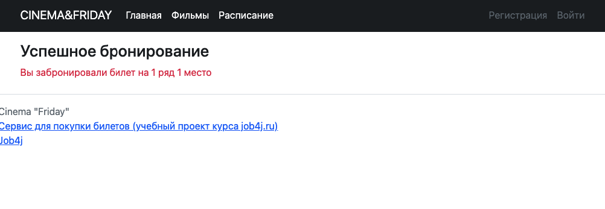
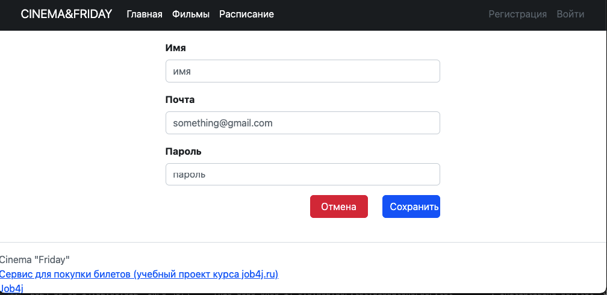
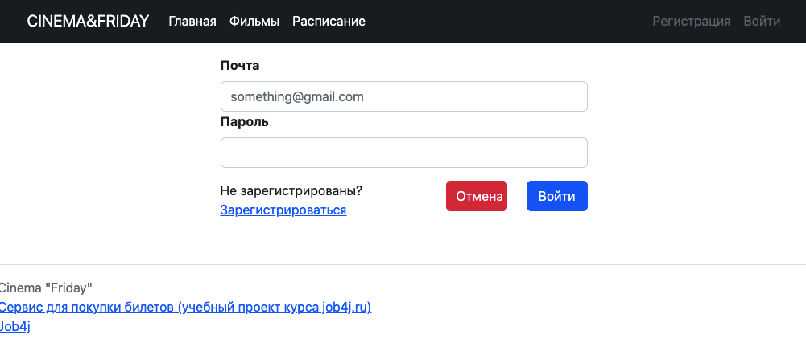

# job4j_cinema

## О проекте
Настоящий проект представляет собой сайт с сервисом по покупке 
билетов в кинотеатр "Cinema&Friday". На сайте можно ознакомиться 
с кинотекой и расписанием сеансов, забронировать билет на выбранные
сеанс и места с подтверждением успешной покупки билета. Покупать
билеты могут только зарегистрированные пользователи, на сайте
реализованы возможности регистрации/входа пользователей. Просматривать
сайт могут любые пользователи.

## Стек технологий

Java 17 & PostgreSQL & Maven & Spring Boot & Liquibase
& Sql20 & Thymeleaf & Bootstrap & JUnit & Mockito

## Требования к окружению

Java 17 & PostgreSQL 14 & Maven 3.8

## Запуск проекта

Для успешной сборки и работы проекта на вашем компьютере должны быть установлены:
JDK 17(+), Maven, PostgreSQL, Tomcat
В PostgreSQL создайте базу с именем "job4j_cinema"
Скачайте проект к себе на компьютер с помощью команды
git clone https://github.com/Helgacom/job4j_cinema.git

``` Todo db connection ```

Выполните команду mvn install в корне проекта для его сборки

С помощью Liquibase произайдёт миграция БД.
В случае успешной сборки появится файл target/job4j_cinema-<version>.war
переименуйте его в cinema.war

Для запуска веб-приложения вам нужно скопировать cinema.war в папку webapps вашего Tomcat
После запуска сервера приложение будет доступно по адресу
http://localhost:8080/cinema/

## Взаимодействие с приложением
### 1. Стартовая страница
Содержит общую информацию о ресурсе и ссылки на разделы сервиса:


### 2. Кинотека
Страница "Фильмы" со списком всех фильмов в прокате:


### 3. Расписание
Основная сервисная страница, с которой можно ознакомиться с расписанием сеансов и забронировать билет



Перейти на страницу покупки можно через ссылку по названию фильма,
страница покупки позволяет пользователю самостоятельно выбрать место, если оно уже занято сервис предложить выбрать другое место, а в случае успешного бронирования выведет информацию об успешной покупке




### 4. Регистрация/вход
Купить билеты могут только рарегистрированные пользователи, для регистрации/входа пользователю необходимо либо заполнить форму регистрации либо войти в свой аккаунт:





## Контакты
https://github.com/Helgacom